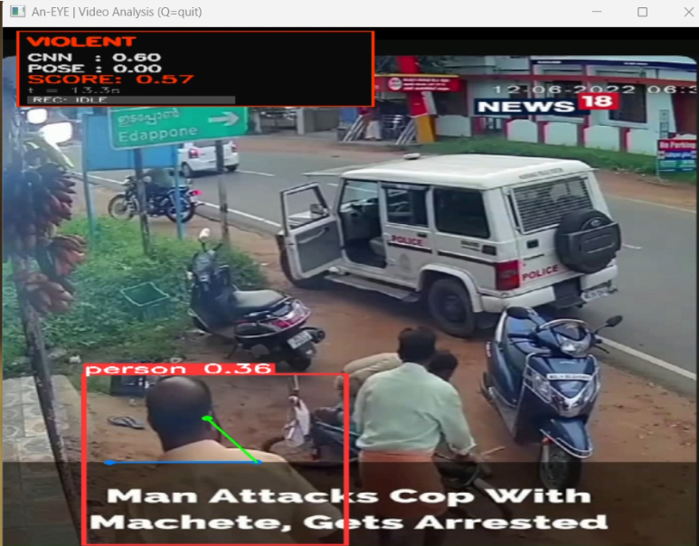

<div align="center">

### An EYE

### AI-Powered Surveillance & Emergency Response Platform

<p align="center">
Transforming passive CCTV infrastructure into intelligent real-time public safety systems.
</p>

# 

<br/>

<a href="https://an-eye-surveillance.vercel.app/">
  
</a>

<a href="https://an-eye-backend.onrender.com">
  
</a>

<a href="mailto:sayanh992@gmail.com">
  
</a>

<a href="mailto:hanumantpratap1234@gmail.com">
  
</a>

<br/>

<a href="https://www.linkedin.com/in/sayan-hazra-4568b2360">
  
</a>

<a href="https://www.linkedin.com/in/hanumant-pratap-869534330/">
  
</a>

</div>

---

<div align="center">


</div>

---

# Overview

**An EYE** is a real-time AI surveillance intelligence platform designed for:

- Violence Detection
- Smart Incident Monitoring
- Emergency Response Assistance
- Evidence Recording
- Police Dashboard Monitoring
- Live AI CCTV Analysis

The platform combines:

- Artificial Intelligence
- Computer Vision
- Real-Time Streaming
- Backend APIs
- WebSocket Communication
- Modern Monitoring Dashboard

to convert traditional CCTV systems into intelligent public safety infrastructure.

---

# Live Deployment

## Police Dashboard

https://an-eye-surveillance.vercel.app/

---

<!--# -->

## Backend Activation

> Backend may sleep because Render free tier is used.

Activate backend by visiting:

https://an-eye-backend.onrender.com

---

# System Workflow

```text
CCTV / Camera Feed
        ↓
Motion Detection
        ↓
Violence Detection AI
        ↓
Pose Intelligence Analysis
        ↓
Threat Validation
        ↓
Evidence Clip Recording
        ↓
Incident Generation
        ↓
FastAPI Backend
        ↓
Realtime Police Dashboard
```

---

# Features

## AI Intelligence

- Real-time violence detection
- Motion analysis
- Human pose estimation
- AI confidence scoring
- Threat classification
- Smart evidence recording
- Multi-frame temporal analysis

---

## Monitoring System

- Live CCTV monitoring
- Webcam support
- ESP32-CAM support
- RTSP stream support
- Multi-camera scalable architecture
- Real-time alert queue

---

## Dashboard Features

- Live police dashboard
- Browser alert notifications
- Alert siren support
- Incident playback
- Status management
- Incident escalation
- Location-aware monitoring

---

## Backend Infrastructure

- FastAPI backend
- PostgreSQL support
- WebSocket communication
- Incident APIs
- Audit logs
- Modular scalable architecture

---

# Tech Stack

<div align="center">

| Category | Technologies |
|---|---|
| AI / ML |    |
| Backend |   |
| Frontend |   |
| Streaming |  |
| Deployment |   |

</div>

---

<div align="center">


</div>

---

# Monorepo Structure

```text
An-EYE-command/
│
├── dashboard/
│   ├── public/
│   ├── src/
│   │   ├── assets/
│   │   ├── components/
│   │   ├── pages/
│   │   ├── services/
│   │   ├── styles/
│   │   ├── utils/
│   │   └── websocket/
│   │       └── socket.js
│   │
│   ├── App.jsx
│   ├── main.jsx
│   ├── vite.config.js
│   └── package.json
│
├── logs/
├── storage/
│
├── An-EYE-incident-ai/
│   │
│   ├── ai_engine/
│   │   ├── services/
│   │   ├── suspect_db/
│   │   ├── suspect_faces/
│   │   └── suspect_system/
│   │
│   ├── config/
│   │   └── cameras.json
│   │
│   ├── detectors/
│   │   ├── pose_detector.py
│   │   └── violence_detector.py
│   │
│   ├── model/
│   ├── streaming/
│   ├── app_v1.py
│   └── requirements.txt
│
└── README.md
```

---

# Specifications

| Requirement | Minimum | Recommended |
|---|---|---|
| RAM | 8 GB | 16 GB |
| CPU | Intel i5 | Ryzen 7 / i7 |
| GPU | Optional | NVIDIA CUDA GPU |
| Python | 3.10+ | 3.10+ |
| OS | Windows / Linux | Ubuntu |

---

# Installation Guide

<details>
<summary><b>1. Clone Repository</b></summary>

<br/>

```bash
git clone https://github.com/prata-hp/An-Eye-surveillance.git
```

```bash
cd An-Eye-surveillance
```

</details>

---

<details>
<summary><b>2. Create Python Virtual Environment</b></summary>

<br/>

## Windows

```bash
python -m venv venv
```

```bash
venv\Scripts\activate
```

---

## Linux / Mac

```bash
python3 -m venv venv
```

```bash
source venv/bin/activate
```

</details>

---

<details>
<summary><b>3. Install AI Dependencies</b></summary>

<br/>

```bash
pip install -r requirements.txt
```

```bash
cd An-EYE-incident-ai
```

```bash
pip install -r requirements.txt
```

</details>

---

<details>
<summary><b>4. Install Frontend Dependencies</b></summary>

<br/>

```bash
cd dashboard
```

```bash
npm install
```

</details>

---

# Running The AI Engine

> Dashboard and backend are already deployed.  
> Only the AI engine needs to run locally.

---

## Start AI Detection Engine

```bash
cd An-EYE-incident-ai
```

```bash
python app_v1.py
```

---

# ngrok Setup For Live Camera Feed

## Install ngrok

https://ngrok.com/download

---

## Authenticate ngrok

```bash
ngrok config add-authtoken YOUR_AUTH_TOKEN
```

---

## Expose Local AI Port

Example:

```bash
ngrok http 5000
```

or

```bash
ngrok http 8000
```

---

## Use Generated Public URL

Example:

```text
https://xxxxx.ngrok-free.app
```

Use this URL inside:
- camera stream source
- backend webhook
- remote AI feed

---

# Environment Variables

## Root `.env`

```env
DATABASE_URL=
SECRET_KEY=
BACKEND_URL=
```

---

## Dashboard `.env`

```env
VITE_BACKEND_URL=
VITE_WS_URL=
```

---


## Project Demo

```md

https://youtu.be/5B948vFbfBs


```

---

# Contributors

| Name | Role |
|---|---|
| Sayan Hazra | AI / Full Stack Development |
| Hanumant Pratap | Backend / Surveillance System |

---

# References

- FastAPI
- OpenCV
- PyTorch
- React
- Vite
- WebSockets
- Render
- Vercel
- ngrok

---

# License

MIT License

---

<div align="center">

Built for intelligent emergency response and public safety infrastructure.

</div> 